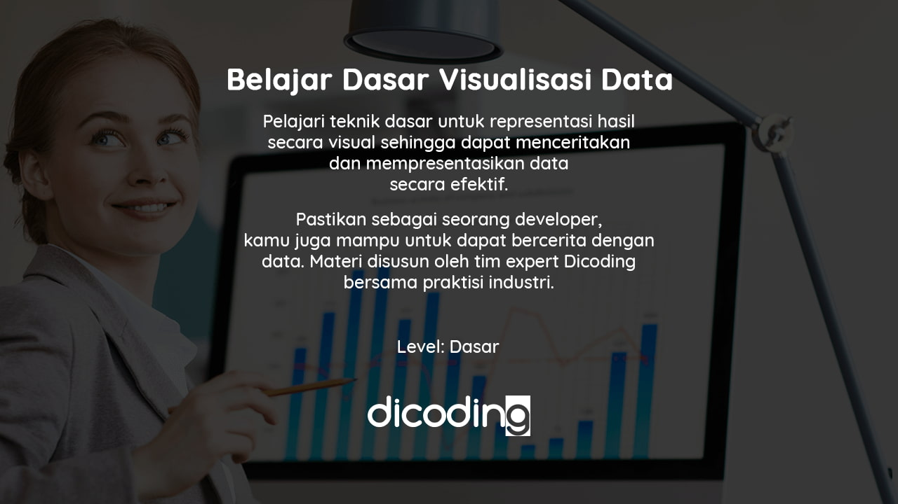
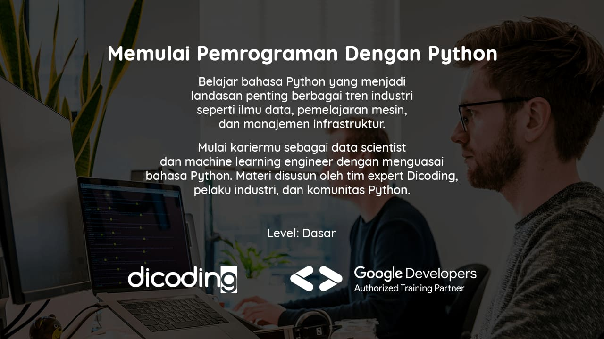
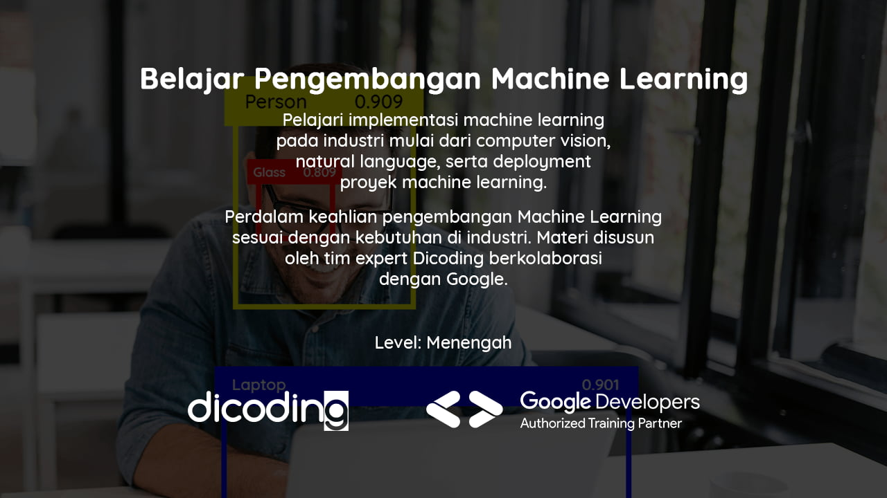
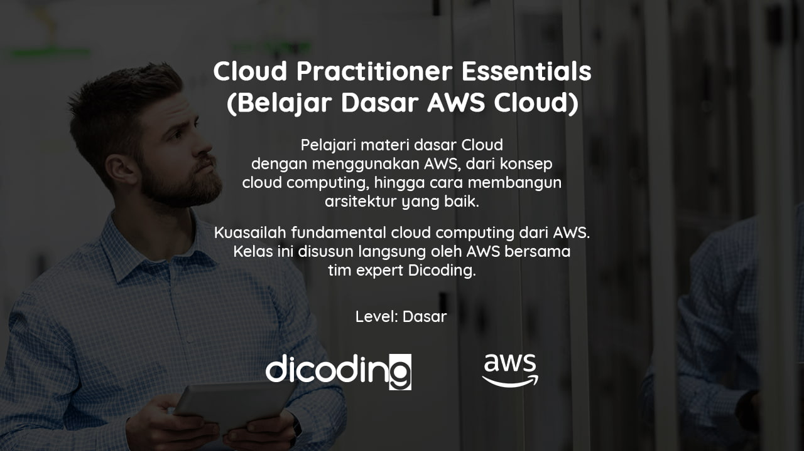

 

  

 

  Visi Dicoding adalah <strong>menjadi platform edukasi teknologi terdepan yang mendorong akses literasi digital yang lebih luas untuk semua</strong>. Dicoding memiliki misi untuk <strong>mengakselerasi transisi Indonesia menuju dunia digital melalui pendidikan teknologi yang mentransformasi kehidupan</strong>.

  Kini semua bangsa bergerak menuju dunia digital yang bertumpu pada inovasi teknologi di semua sendi kehidupan. Kami yakin pendidikan teknologi adalah fondasi bagi setiap bangsa agar menjadi yang terdepan dalam menghadapi dunia digital. Dicoding hadir sebagai platform pendidikan teknologi yang membantu menghasilkan talenta digital berstandar global. Semua demi mengakselerasi Indonesia agar menjadi yang terdepan.

  Letter from the CEO signature

  

  Narenda Wicaksono 
  CEO Dicoding

 

---

  

<h1 align="center">Machine Learning Developer</h1>

Deskripsi

    Seorang Machine Learning Developer adalah pakar dalam menggunakan data untuk model pelatihan. Model-model tersebut kemudian digunakan untuk mengotomatisasi proses seperti klasifikasi gambar, pengenalan suara, dan perkiraan pasar. Sering kali ada penggabungan dengan peran data scientist atau artificial intelligence (AI) engineer. Machine learning adalah subbidang AI yang berfokus pada analisis data untuk menemukan hubungan antara input dan output yang diinginkan. Seorang pengembang pemelajaran mesin harus mampu menghasilkan solusi yang dibuat khusus untuk setiap masalah dan mencapai hasil optimal dengan hati-hati memproses data dan memilih algoritma terbaik untuk konteks yang diberikan.

    Kurikulum Machine Learning di Dicoding telah dikembangkan langsung bersama IBM dan Google menggunakan kurikulum resmi dari masing-masing perusahaan. Setiap langkah dalam learning path ini telah didesain agar siswa dapat memiliki pengetahuan yang cukup untuk menjadi seorang Machine Learning Developer yang dapat memenuhi kebutuhan industri.

Daftar Modul

1. Belajar Dasar Visualisasi Data [[🔍](https://www.dicoding.com/academies/177)]  [[📃](https://www.dicoding.com/certificates/07Z6L9LNWPQR)]

    

    Pelajari teknik dasar untuk representasi hasil secara visual sehingga dapat menceritakan dan mempresentasikan data secara efektif.

2. Memulai Pemrograman Dengan Python [[🔍](https://www.dicoding.com/academies/86)] [[📃](https://www.dicoding.com/certificates/JMZVMJYOQZN9)]

    

    Belajar Python yang menjadi landasan penting berbagai tren industri seperti ilmu data, pemelajaran mesin, dan manajemen infrastruktur.

3. Belajar Machine Learning untuk Pemula [[🔍](https://www.dicoding.com/academies/184)] [[📃](https://www.dicoding.com/certificates/98XW6161LXM3)] [[📁](https://github.com/myarist/Rock-Paper-Scissors)]

    

    Pelajari materi dasar pengembangan machine learning dan langkah menciptakan model machine learning pertamamu untuk memproses data.

    

4. Belajar Pengembangan Machine Learning [[🔍](https://www.dicoding.com/academies/185)] [[📃](#)] [[📁](#)]

    

    Pelajari implementasi machine learning pada industri mulai dari computer vision, natural language, serta deployment proyek machine learning.

---

  

<h1 align="center">Cloud and Back-End Developer  Scholarship Program</h1>

Deskripsi

    Back-End Developer merupakan salah satu profesi paling berkembang di Indonesia (LinkedIn 2020 Emerging Jobs Report Indonesia). Spesialisasi ini jadi incaran di kalangan industri IT dan layanannya, perangkat lunak, internet hingga layanan keuangan. Secara job-desk, developer di bidang ini bertanggung jawab untuk menyediakan kebutuhan yang tak terlihat oleh pengguna web, seperti bagaimana data disimpan, diolah, serta ditransaksikan secara aman.

    Demikian krusial peran Back-End Developer, namun jumlah programmer yang sangat ahli di bidang ini, sangat terbatas. Sebabnya, prinsip pembelajaran programming di sekolah formal memang didesain untuk menyajikan ragam pilihan belajar. Siswa diharapkan memilih dan mendalami sendiri spesialisasi yang diinginkannya, termasuk dalam hal ini tema Back-End Developer. Faktanya, terdapat 400.000 pembelajar-lulusan IT setiap tahunnya serta ribuan pendidik di bidang IT yang berpotensi mengisi dan memajukan profesi Back-End Developer di tanah air.

Daftar Modul

1. Cloud Practitioner Essentials (Belajar Dasar AWS Cloud) [[🔍](https://www.dicoding.com/academies/251)]  [[📃](#)]

    

    Pelajari materi dasar Cloud dengan menggunakan AWS, dari konsep cloud computing, hingga cara membangun arsitektur yang baik.

2. Architecting on AWS (Membangun Arsitektur Cloud di AWS) [[🔍](https://www.dicoding.com/academies/266)]  [[📃](#)]

    

    Pelajari cara membangun arsitektur cloud di AWS, dari yang sederhana dengan Amazon S3, hingga yang canggih dengan serverless.

